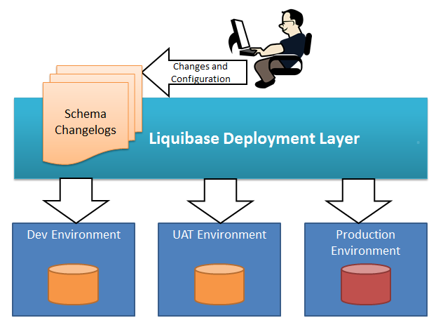

## Why this project ?
this project explain how you can integrate liquibase on a project spring boot and how to use the changeset + loadData from CSV file

## What's liquibase ?
Liquibase is an open source library for tracking, managing, and enforcing DBMS-independent database schema changes. It was launched in 2006 to help track database changes, especially in an agile software development environment.
 

## What is the competitor of liquibase in the market ?
There is also Flyway, to know more about the difference, here is the image below :

## You can test the Api's from this project
- http://localhost:8080/departments/all
- http://localhost:8080/employees/all